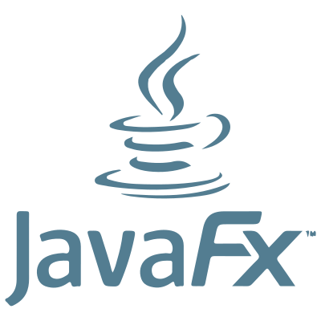
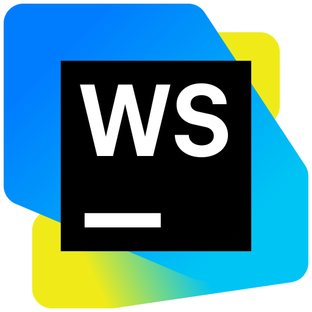
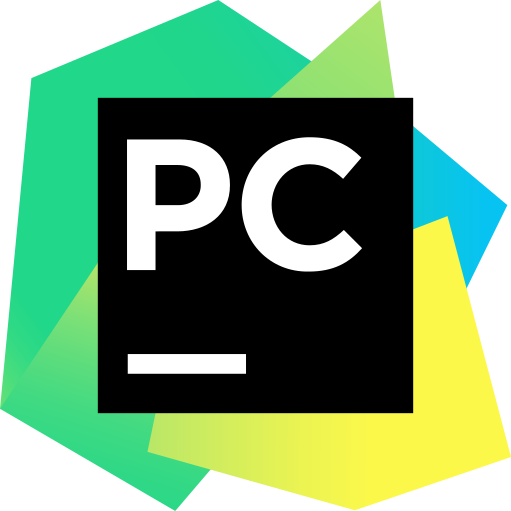
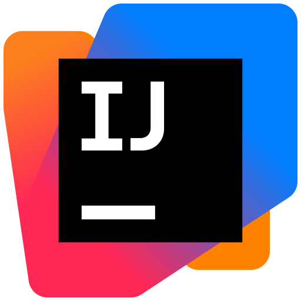

# Bonjour

Je m'appelle Abdellah, étudiant en informatique. Je m'intéresse dans mon temps libre au développement de jeux vidéos et à l'UI design. 🖥

---

### Technologies

#### Web

  
  
  
  
  
  
  
  

#### Python

  
  

#### Java

  
  
  
  

#### Base de données

  
  
  

#### C#

  
  

#### Gestion de projet

  
  
  
  

#### Shell

  
  

#### Systèmes d'exploitation

  
  

#### IDEs

  
  
  
  

#### Langage appris à l'IUT dont je doute qu'il me soit utile

  

