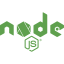
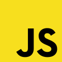
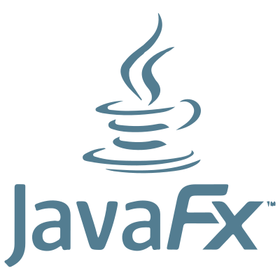
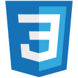
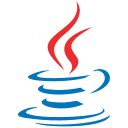

# Bonjour

Je m'appelle Abdellah, étudiant en informatique. Je m'intéresse dans mon temps libre au développement de jeux vidéos et à l'UI design.

---

### Technologies auxquelles je touche

#### Web

  
  
  
  
  

#### Front-end

  
  
  
  
  

#### Langages de programmation

  
  
  
  

#### Base de données

  
  
  

#### Gestion de projet

  
  
  
  
  
  

#### Shell

  
  

#### Jeux-vidéos

  

